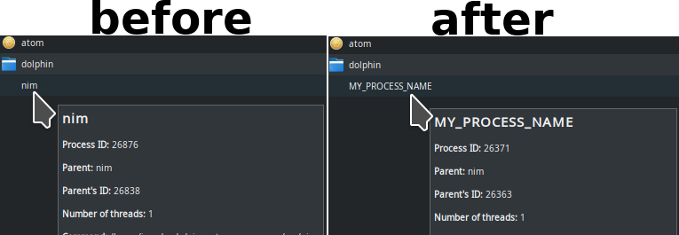

# nim-os-util

- Set the current Process name in Nim, shows up on system monitor with custom name.
- Turn Display Off using Nim, 1 proc, turns off monitor, designed for long running tasks on mobile devices to save battery.
- Set the current Process CPU Usage Limit cap from 5% to 100% on global percentage.




# Use

```nim
>>> import osutil
>>> echo set_process_name("MyAwesomeNimApp")
>>> discard set_process_cpu_limit(50)  # Max CPU usage 50%, 5%~100% is valid.
>>> echo set_display_off()
(output: "", exitCode: 0)
```


# Install

```
nimble install osutil
```


# Requisites

- `cpulimit`
- `ionice`
- `xset`


# Documentation

<details>
    <summary><b>set_process_name("SomeName")</b></summary>

**Description:**
Set the current Process name in Nim, shows up on system monitor with custom name.

If you dont set the process name it will show up as `"nim"` or `"main"` or
the filename of the main executable.

For SysAdmins and DevOps is important to quickly identify a particular process on
the system monitor, that can be a GUI or a command like `htop` or `glances`.

Giving a proper name to your processes makes your software feel more professional.

Uses a low level call to `libc.so`. **Only available on Linux.**

**Arguments:**
- `name` A Name for your Process, `string` type, required.

**Returns:** None.

</details>


<details>
    <summary><b>set_process_cpu_limit(limit)</b></summary>

**Description:**
Set the current Process CPU Usage Limit cap from 5% to 100% on global percentage.

`5` ~ `100` is valid. 100% makes almost no effect.

This is designed for background unimportant stuff, do not use on user-facing GUI!.

It starts a child sub-process that will cap the main process, when main process ends so does the sub-process.

With this you can trade speed for lower CPU resource usage, for example you can extend battery life on mobile devices by doing so.

Uses `cpulimit` **Only available on Linux.**

**Arguments:**
- `limit` A Limit on CPU Usage on Percentage for your Process, global percentage for all CPU Cores,
`range[5..100]` type, defaults to `5` which means 5% CPU max, required.

**Returns:** `Process`.

</details>


<details>
    <summary><b>set_process_ionice(scheduling_class)</b></summary>

**Description:**
Set the current Process I/O Usage Limit cap from "Idle" to "Real-Time".

Its similar to https://nim-lang.org/docs/posix.html#nice,cint but for I/O.

`0` ~ `3` is valid. `2` makes no effect. This may delay I/O Operations to disk.

`0` is `none`, `1` is `RealTime`, `2` is `best-effort` (Default), `3` is `idle`.

The default of all systems is `2`, `best-effort`.

This is designed for background unimportant stuff, do not use on user-facing GUI!.

With this you can trade speed for lower I/O resource usage, for example you can extend battery life on mobile devices by doing so.

Uses `ionice` **Only available on Linux.**

**Arguments:**
- `scheduling_class` A Limit on I/O Usage for your Process,
`range[0..3]` type, defaults to `3` which means `idle`, `idle` means use I/O when idle, required.

**Returns:** `tuple[output: TaintedString, exitCode: int]`.

</details>


<details>
    <summary><b>set_display_off()</b></summary>

**Description:**
Turn Display Off using Nim, crossplatform, 1 proc, turns off monitor,
designed for long running tasks on mobile devices.

**Arguments:** None.

**Returns:** `tuple[output: TaintedString, exitCode: int]`.

</details>
